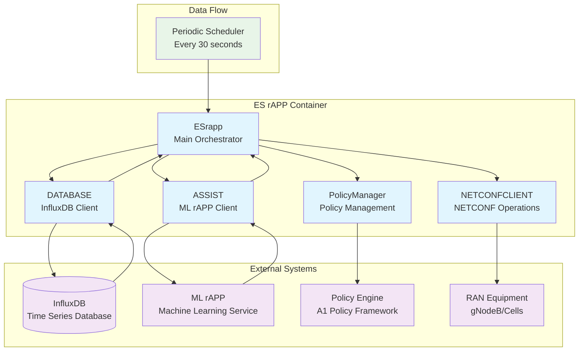
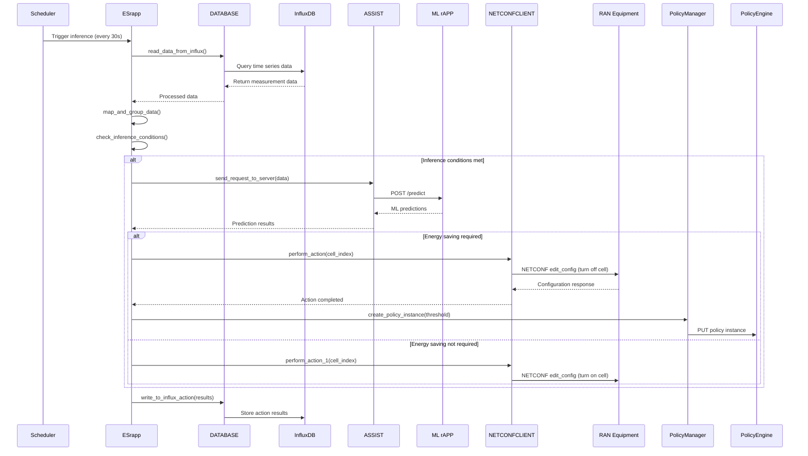

# ES rAPP System Architecture and Class Diagrams

This document provides a comprehensive overview of the Energy Saving rAPP (ES rAPP) system architecture and class relationships based on the current codebase.

## System Architecture

The following diagram shows the high-level system architecture and component interactions:



## Component Workflow

The ES rAPP follows this operational workflow:



## Class Diagram

The following diagram shows the class relationships and their key methods:

```mermaid
classDiagram
    class ESrapp {
        -database: DATABASE
        -assist: ASSIST
        -netconf_client: NETCONFCLIENT
        -policy_manager: PolicyManager
        -logger: Logger
        +__init__(config_file)
        +read_config_file()
        +set_logger()
        +inference()
        +map_and_group_data(data)
        +check_inference_conditions()
        +run()
    }
    
    class DATABASE {
        -client: InfluxDBClient
        -bucket: str
        -org: str
        -token: str
        -url: str
        -logger: Logger
        +__init__(config_file)
        +connect()
        +read_data_from_influx() dict
        +write_to_influx_action(results)
        +close_connection()
    }
    
    class ASSIST {
        -server_url: str
        -logger: Logger
        +__init__(server_url)
        +send_request_to_server(data) dict
    }
    
    class NETCONFCLIENT {
        -logger: Logger
        +convert_to_xml(index) str
        +perform_action(index)
        +convert_to_xml_1(index) str
        +perform_action_1(index)
    }
    
    class PolicyManager {
        -base_url: str
        -policy_type_id: str
        -logger: Logger
        +__init__(base_url, policy_type_id)
        +create_policy_type()
        +create_policy_instance(threshold_value)
    }
    
    %% Relationships
    ESrapp --> DATABASE : uses
    ESrapp --> ASSIST : uses
    ESrapp --> NETCONFCLIENT : uses
    ESrapp --> PolicyManager : uses
    
    %% External dependencies (shown as interfaces)
    DATABASE ..> InfluxDBClient : depends on
    ASSIST ..> HTTPRequests : depends on
    NETCONFCLIENT ..> NCClient : depends on
    PolicyManager ..> HTTPRequests : depends on
    
    %% Styling
    classDef main fill:#e3f2fd
    classDef helper fill:#f1f8e9
    classDef external fill:#fce4ec
    
    class ESrapp main
    class DATABASE,ASSIST,NETCONFCLIENT,PolicyManager helper
```

## Key Components Description

### ESrapp (Main Orchestrator)
- **Purpose**: Main application class that coordinates all operations
- **Key Functions**:
  - Schedules periodic inference operations (every 30 seconds)
  - Orchestrates data collection, ML inference, and action execution
  - Manages configuration and logging setup
  - Coordinates between all subsystem components

### DATABASE (InfluxDB Client)
- **Purpose**: Handles all InfluxDB operations for time-series data
- **Key Functions**:
  - Reads historical measurement data for ML inference
  - Writes action results and system state back to database
  - Manages database connection lifecycle
  - Handles query construction and error management

### ASSIST (ML rAPP Communication)
- **Purpose**: Communicates with the ML rAPP service via REST API
- **Key Functions**:
  - Sends formatted data to ML rAPP for prediction
  - Handles HTTP request/response with ML service
  - Manages communication errors and retries

### NETCONFCLIENT (Network Configuration)
- **Purpose**: Performs NETCONF operations on RAN equipment
- **Key Functions**:
  - `perform_action()`: Turns off cells for energy saving
  - `perform_action_1()`: Turns on cells when energy saving not needed
  - Constructs XML configurations for 3GPP NR cell management
  - Manages NETCONF connections to gNodeB equipment

### PolicyManager (A1 Policy Framework)
- **Purpose**: Manages policy types and instances in the A1 Policy Framework
- **Key Functions**:
  - Creates policy types for threshold-based energy saving
  - Creates policy instances with specific threshold values
  - Communicates with policy engine via REST API

## Data Flow Summary

1. **Data Collection**: InfluxDB stores time-series measurements from network equipment
2. **Periodic Processing**: ESrapp runs every 30 seconds to check for inference conditions
3. **ML Inference**: Qualified data is sent to ML rAPP for energy saving predictions
4. **Action Execution**: Based on ML results, cells are turned on/off via NETCONF
5. **Policy Management**: Threshold-based policies are created in the A1 framework
6. **Result Storage**: Actions and results are stored back in InfluxDB for tracking

## Technology Stack

- **Language**: Python 3.x
- **Database**: InfluxDB (time-series data storage)
- **Communication**: REST APIs, NETCONF protocol
- **ML Integration**: HTTP-based ML rAPP service
- **Scheduling**: Python `schedule` library
- **Logging**: `mdclogpy` for structured logging
- **Containerization**: Docker with Kubernetes deployment
- **Standards**: 3GPP NR, O-RAN Alliance specifications
