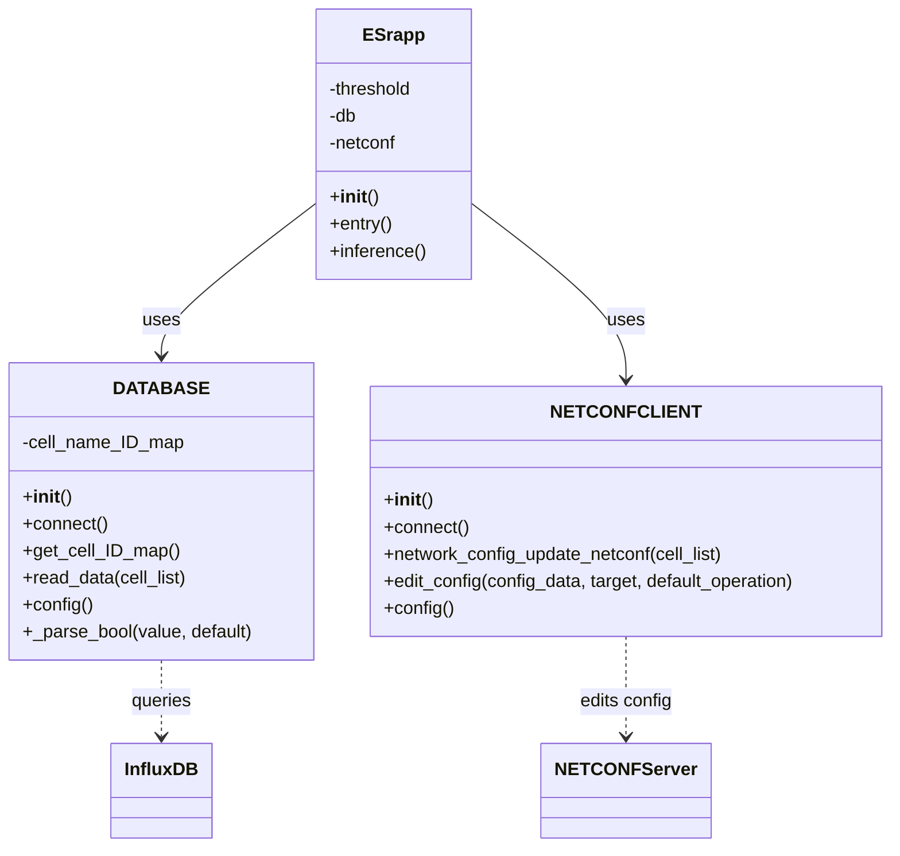
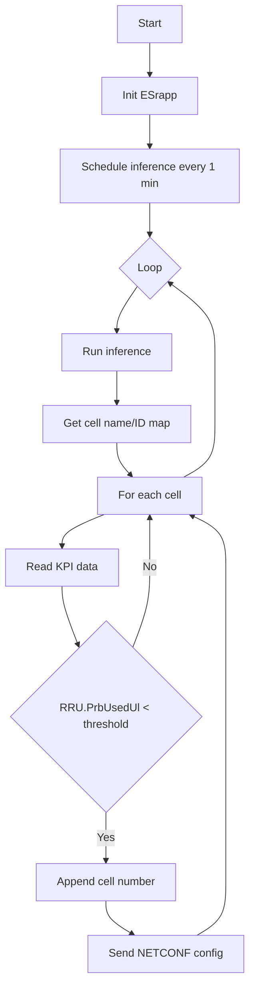
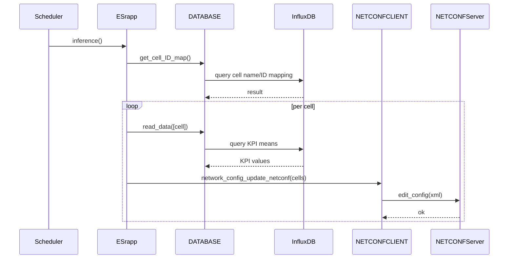

# OSC Non-RT RIC Energy Saving rAPP

## Outline
- [1. Introduction of the Energy Saving (ES) rApp template](#1-introduction-of-the-energy-saving-es-rapp-template)
- [2. Project Structure](#2-project-structure)
- [3. Input and output](#3-input-and-output)
  - [3.1 Input: PM metrics access from influxDB](#31-input-pm-metrics-access-from-influxdb)
  - [3.2 Output: Netconf cell on/off control](#32-output-netconf-cell-onoff-control)
- [4. Class Diagram](#4-class-diagram)
- [5. Flowchart](#5-flowchart)
- [6. Message Sequence Chart (MSC)](#6-message-sequence-chart-msc)
- [7. Helm Deployment Guide](#7-helm-deployment-guide)
- [Citation](#citation)

## 1. Introduction of the Energy Saving (ES) rApp template
- This is the sample of the rApp for package the rApp as a image and give the sample access of input (PM metrics) and output (Netconf cell on/off control).

## 2. Project Structure
```
nonrtric-rapp-energysaving/
├─ README.md
├─ CITATION.cff
├─ ES rApp/
│  ├─ Chart.yaml
│  ├─ values.yaml
│  ├─ templates/
│  │  ├─ deployment.yaml
│  │  ├─ service.yaml
│  │  └─ configmap.yaml
│  └─ src/
│     ├─ main.py
│     ├─ data.py
│     ├─ nectconfclient.py
│     └─ config.yaml

```

## 3. Input and output
### 3.1 Input: PM metrics access from influxDB
- The example metrics structure of the PM metrics from influxDB

| table | _measurement | _field | _value | _start | _stop | _time | CellID |
| --- | --- | --- | --- | --- | --- | --- | --- |
| 0 | CellReports | Viavi.Cell.Name | S1/SMALL CELL - 30DBM/C1 | 2026-03-09T15:22:31.214Z | 2026-03-16T15:22:31.214Z | 2026-03-09T15:30:00.000Z | GnbCuCpFunction=1,NrCellCu=1 |
| 0 | CellReports | RRC.ConnMean | 0 | 2026-03-09T15:20:36.053Z | 2026-03-16T15:20:36.053Z | 2026-03-09T15:30:00.000Z | GnbCuCpFunction=1,NrCellCu=1 |
| 0 | CellReports | DRB.UEThpDl | 0 | 2026-03-09T15:25:26.436Z | 2026-03-16T15:25:26.436Z | 2026-03-09T15:30:00.000Z | GnbDuFunction=1,NrCellDu=1 |

### 3.2 Output: Netconf cell on/off control
- The example xml format of the cell on/off control
```
<config xmlns:nc="urn:ietf:params:xml:ns:netconf:base:1.0">
  <ManagedElement xmlns="urn:3gpp:sa5:_3gpp-common-managed-element">
    <id>1193046</id>
    <GNBCUCPFunction xmlns="urn:3gpp:sa5:_3gpp-nr-nrm-gnbcucpfunction">
        <id>1</id>
        <NRCellCU xmlns="urn:3gpp:sa5:_3gpp-nr-nrm-nrcellcu">
            <id>1</id>
            <CESManagementFunction xmlns="urn:3gpp:sa5:_3gpp-nr-nrm-cesmanagementfunction">
                <id>1</id>
                <attributes>
                    <energySavingControl>toBeEnergySaving</energySavingControl>
                </attributes>
            </CESManagementFunction>
        </NRCellCU>
    </GNBCUCPFunction>
  </ManagedElement>
</config>
``` 
- Cell on control: `toBeNotEnergySaving`
- Cell off control: `toBeEnergySaving`
- *Causion: The `NRCellCU.id` and `CESManagementFunction.id` need to follow the netconf get_config from viavi.*

## 4. Class Diagram


## 5. Flowchart


## 6. Message Sequence Chart (MSC)


## 7. Helm Deployment Guide
This guide packages the Helm chart into a `.tgz` and installs it.

### 6.1 Package the chart
From the repository root:
```bash
helm package "ES rApp" -d ./dist
```
This will create a file like `dist/energy-saving-<version>.tgz` based on [ES rApp/Chart.yaml](ES%20rApp/Chart.yaml).

### 6.2 Install the chart
```bash
helm install energy-saving ./dist/energy-saving-<version>.tgz \
  --namespace test-rapp --create-namespace
```

### 6.3 Configure values (optional)
You can override values via `-f` or `--set`:
```bash
helm install energy-saving ./dist/energy-saving-<version>.tgz \
  --namespace test-rapp --create-namespace \
  -f my-values.yaml
```

To upgrade after changes:
```bash
helm upgrade energy-saving ./dist/energy-saving-<version>.tgz \
  --namespace test-rapp
```

### Citation
If you use this project in your research or wish to cite it, please use below citation:

```
@software{Lan_nonrtric-rapp-energysaving_2025,
author = {Lan, Yong-Yi and Zhang, Han-Hong and Bimo, Fransiscus Asisi},
month = jul,
title = {{nonrtric-rapp-energysaving}},
url = {https://github.com/bmw-ece-ntust/nonrtric-rapp-energysaving},
version = {1.0.0},
year = {2025}
}
```